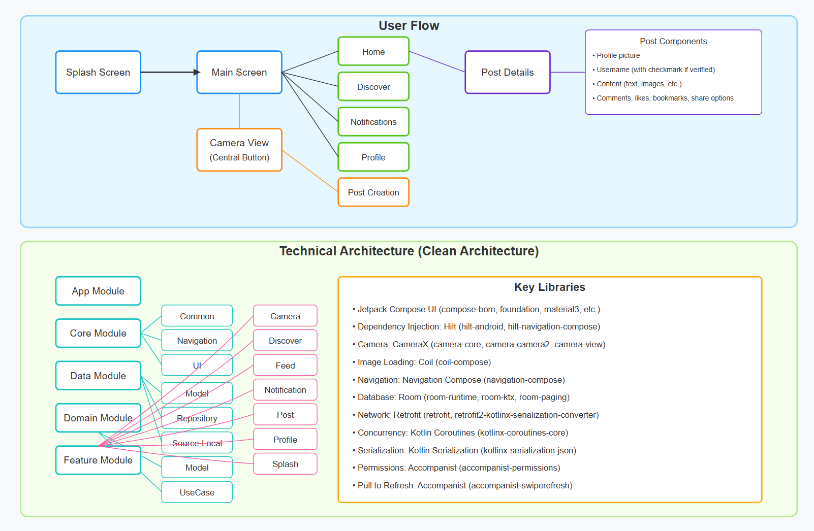

# Loop Social App

A modern Android social media application built with Jetpack Compose and following Clean Architecture principles.


### Key Features

- **Home Feed**: View trending threads and recently shared posts
- **Discover**: Browse content by tags, discover popular content and suggested users
- **Camera Integration**: Capture and share photos with flash and selfie options
- **Posts**: Support for rich content with comments, likes, bookmarks, and sharing
- **Notifications**: Real-time updates on interactions with your content
- **User Profiles**: Personalized profiles with posts, subscriptions, and activity history
- **Dark Mode**: Dark mode support for a comfortable viewing experience

## 📸 Screenshots

<table>
  <tr>
    <td></td>
    <td></td>
    <td></td>
  </tr>
  <tr>
    <td></td>
    <td></td>
    <td></td>
  </tr>
</table>



## 🏗️ Architecture

This application is built using **Clean Architecture** principles to ensure scalability, maintainability, and testability. The project is organized into multiple modules:

### Module Structure

The project follows a modular architecture with these key components:

**App Module**
- Main application entry point

**Core Module**
- `common`: Shared utilities, extensions, and base classes
- `navigation`: Navigation components and routes
- `ui`: Shared UI components and themes

**Data Module**
- `model`: Data models and DTOs
- `repository`: Repository implementations
- `source-local`: Local data sources (Room database)

**Domain Module**
- `model`: Domain entities
- `usecases`: Business logic use cases

**Feature Modules**
- `camera`: Camera functionality
- `discover`: Discovery screen functionality
- `feed`: Home feed implementation
- `notification`: Notifications handling
- `post`: Post creation and details
- `profile`: User profile implementation
- `splash`: Splash screen

### User Flow

1. App launches with a splash screen
2. Main screen displays with bottom navigation (Home, Discover, Notifications, Profile)
3. Central camera button for creating new posts
4. Posts can be interacted with (comments, likes, bookmarks, sharing)
5. Detailed post view accessible by clicking on posts
6. Camera flow leads to post creation with tagging and location features

## 🛠️ Tech Stack

### UI
- **Jetpack Compose** - Modern declarative UI toolkit
- **Material 3** - Material design components
- **Coil** - Image loading library
- **Accompanist** - Compose UI utilities

### Architecture & DI
- **MVVM** - Presentation layer architecture
- **Hilt** - Dependency injection
- **Navigation Compose** - Screen navigation

### Data & Networking
- **Room** - Local database
- **Retrofit** - HTTP client
- **Kotlin Serialization** - JSON parsing

### Async
- **Kotlin Coroutines** - Asynchronous programming
- **Flow** - Reactive streams

### Camera
- **CameraX** - Camera API abstraction

## 📝 Dependencies

```kotlin
// Core libraries
androidx-compose-bom = { module = "androidx.compose:compose-bom", version.ref = "composeBom" }
androidx-core-ktx = { group = "androidx.core", name = "core-ktx", version.ref = "coreKtx" }
androidx-foundation = { module = "androidx.compose.foundation:foundation" }
material3 = { module = "androidx.compose.material3:material3" }

// Dependency Injection
hilt-android = { module = "com.google.dagger:hilt-android", version.ref = "hiltAndroid" }
androidx-hilt-navigation-compose = { module = "androidx.hilt:hilt-navigation-compose", version.ref = "hiltNavigationCompose" }

// Camera
androidx-camera-core = { module = "androidx.camera:camera-core", version.ref = "cameraView" }
androidx-camera-camera2 = { module = "androidx.camera:camera-camera2", version.ref = "cameraView" }
androidx-camera-lifecycle = { module = "androidx.camera:camera-lifecycle", version.ref = "cameraView" }
androidx-camera-view = { module = "androidx.camera:camera-view", version.ref = "cameraView" }

// Database
androidx-room-runtime = { module = "androidx.room:room-runtime", version.ref = "roomRuntime" }
androidx-room-ktx = { module = "androidx.room:room-ktx", version.ref = "roomRuntime" }
androidx-room-paging = { module = "androidx.room:room-paging", version.ref = "roomRuntime" }

// Networking
retrofit = { module = "com.squareup.retrofit2:retrofit", version.ref = "retrofit" }
retrofit2-kotlinx-serialization-converter = { module = "com.jakewharton.retrofit:retrofit2-kotlinx-serialization-converter", version.ref = "retrofit2KotlinxSerializationConverter" }
kotlinx-serialization-json = { module = "org.jetbrains.kotlinx:kotlinx-serialization-json", version.ref = "kotlinxSerializationJson" }

// Async
kotlinx-coroutines-core = { module = "org.jetbrains.kotlinx:kotlinx-coroutines-core", version.ref = "kotlinxCoroutinesCore" }

// UI utilities
accompanist-permissions = { module = "com.google.accompanist:accompanist-permissions", version.ref = "accompanistPermissions" }
accompanist-swiperefresh = { module = "com.google.accompanist:accompanist-swiperefresh", version.ref = "accompanistSwiperefresh" }
coil-compose = { module = "io.coil-kt:coil-compose", version.ref = "coilCompose" }